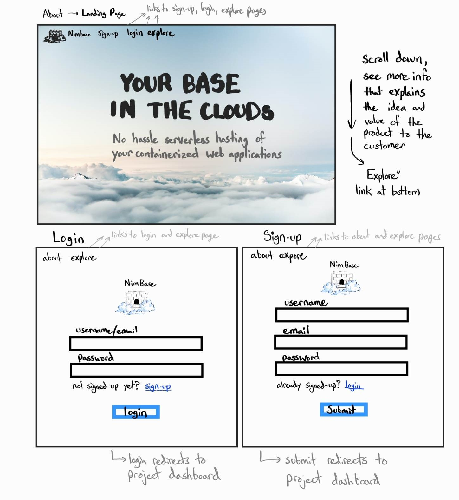
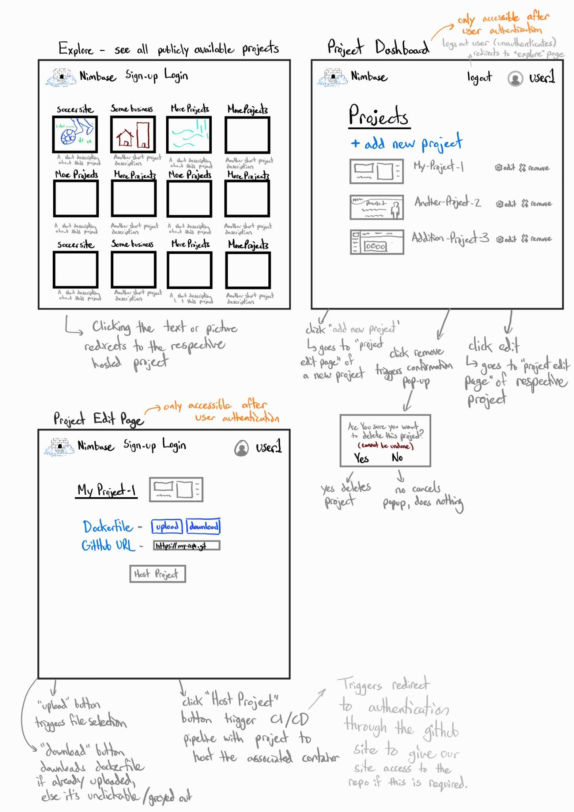

# CPSC 455 Project Progress #1: Project Requirements

###### Group Members: Nick Mercuri, Landseer Enga, Phillip Tellier, Jake Milad, Bhairaw Aryan
###### Github Repo Link: https://github.com/ptellier/nimbase
###### Project name: *Nimbase*

## Project Description

### Who is NimBase for?

Anyone who wants to host a web application that can be containerized with a docker file, 
especially students who want to create a project quickly for a class or to showcase a project to employers.

### What will it do?

It Takes in a GitHub repo link and a dockerfile from many different users and uses these 
as code to build each user’s containerized web application. 
Our project hosts many people's personal projects on one platform and can make them publicly 
accessible through the internet using a reverse proxy manager. The platform will allow users 
to sign in and edit their postings i.e. adding postings, removing postings, editing the GitHub repo link, 
docker file, and toggling if the application is publicly accessible through the internet. The “explore” 
page of our site lets anyone on the internet browse publicly hosted projects.

### What type of data does Nimbase store in its database?

- The MongoDB database will store docker files(file), GitHub URLs(string), and GitHub login credentials, each of which will be linked to a user account for which we will store an email (string), username(string), and the hashes of passwords(string) and salt(string).

### What will users be able to do with this data?
- The dockerfile, GitHub URL, and GitHub login credentials allow for building and hosting of each users’ applications through a CI/CD pipeline that we will create. Storing the hashed passwords, salt, and usernames/emails will allow us to authenticate users to make sure only users can alter their own project hosting.

### What is some additional functionality to add/remove based on time constraints?

- We could remove the AWS hosting of the server and just run the hosting platform for the containers, the database, and the front-end service on one computer locally (on localhost).
- We could simplify password authentication by storing the passwords in plaintext.
- We could simplify it so that only one container is hostable on our service 
- We could scrap the functionality to add team-mates to a project
- We could scrap the functionality for users to create an "enterpise" in our system

### Project task requirements:

##### 3-5 minimal requirements (will definitely complete)
- Create an interface to sign-in/authenticate users
- Have a page for users to edit the applications they want to host on our server
- Create a front-end for users to be able to select a GitHub repo and docker file for making their container
- Set up a MongoDB database that stores user account info, GitHub repo links, docker files, and authentication tokens
- Use GitHub actions for CI/CD. Create a pipeline which pulls the changes from GitHub, builds the dockerfile, pushes the docker image to an image repo,and runs it in a container

##### 3-7 "standard" requirements (will most likely complete)
- Have a front-end for anyone on a search engine like Google to look at all the hosted projects. This would not require authentication
- Set up a reverse proxy manager to redirect to the correct containers hosting different web apps
- Toggle the visibility for hosted projects so that users can choose to make their project private or public
- Create a Landing page that shows all publicly available web applications with a picture, a title, short description, and a link to use each hosted project

##### 2-3 stretch requirements (plan to complete at least 1!)
- Create a server cluster on AWS to host the service, possibly including scaling server resources based on demand and the number of users that want to host their
  applications on our server
- Set up a teammate system that allows users to add each other to a team for their project (preferred choice)
- Set up a system for users to create an enterprise in which only they have the authority to add instructors

### Pick 2 of your minimal requirements and break each of them down into ~2-5 smaller tasks! This will help you divide up work among your teammates

##### Minimal task 1

###### Requirement: Setup MongoDB Database that stores user account info, GitHub repo links, docker files and authentication tokens.

- Design the data structure that would be best implemented to adhere to our project requirements. This entails looking at the relationships between the data we are collecting and storing and if and how other parts of the project would require that data.
- Following the structure of the database, we need collections for storing user account info, GitHub repo links, docker files and authentication tokens.
- Develop the create, read, update and delete operations for each collection
- Test the database with edge cases and potential bugs, ensuring data integrity. This will be testing the create, read, update and delete functionality and making sure data is collected, stored and retrieved properly.

##### Minimal task 2 Jake

###### Requirement: Create an interface to sign-in/ authenticate users to edit the applications they want to host on our server.

- Research and decide on an authentication method. This could be password-based authentication, multi-factor authentication and token-based authentication.
- Design the user interface for the sign-in page. This would require fields for username/ email and password, and a submission button to “Sign-In” and a “forgot your password” button as well.
- Develop the frontend in react. This will look like a sign-in component and would likely have a statement management library to manage user state. The component will also contain the functions that send POST requests to our back-end.
- Implement the server-side code that will handle all sign-in requests. This involves validating users input, checking credentials against the database and sending the correct response back to the frontend.
- Test the authentication system to prevent potential threats and vulnerabilities in the system.

### 2-3 rough sketch prototypes of some key tasks of your app

Home, login, signup and signup pages and their functionality

Explore, project dashboard, and edit project pages and their functionality

