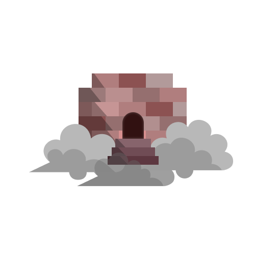

# CPSC 455 Project Progress #1: Project Requirements

###### Group Members: Landseer Enga, Phillip Tellier, Jake Milad, Bhairaw Aryan
###### Github Repo Link: https://github.com/ptellier/nimbase
###### Project name: *Nimbase*

## Project Description

Nimbase is a web application that lets anyone host any application that can be containerized with a docker file.
Simply create an account, give Nimbase a link to your GitHub repository and upload a docker file.
Then Nimbase will build your app, host it, and make it available from anywhere on the internet.

### Project Goals:

##### "minimal" goals
- Interface to sign-in/authenticate users ✅
- Page for users to edit the applications they want to host on our server ✅
- Front-end for users to be able to select a GitHub repo and docker file for making their container ✅
- MongoDB database that stores user account info, GitHub repo links, docker files, and authentication tokens ✅
- Workflow using Node.js/Express.js which clones a GitHub repo, builds an image using the provided dockerfile and repo files, and runs a container created from the image ✅

##### "standard" goals
- "Explore" page for anyone on the Nimbase site to look at all the (publicly) hosted projects. This would not require authentication. ✅
- Reverse proxy manager redirects users on the internet to the correct containers hosting different web apps. ✅
- Visibility toggle for hosted projects so that users can choose to make their project private or public ✅
- Landing page (no authentication required) that describes the Nimbase and its features ✅ 

##### "stretch" goals
- Create a server cluster on Digital Ocean to host the hosting service along with all its underlying hosted containers ✅
- Teammate system that allows users to add each other to a team for their project ✅
- System for users to create an enterprise in which only they have the authority to add instructors ❌

### Incorporation of Different Technologies

### Above and beyond functionality

### Next Steps

### Team Member Contributions